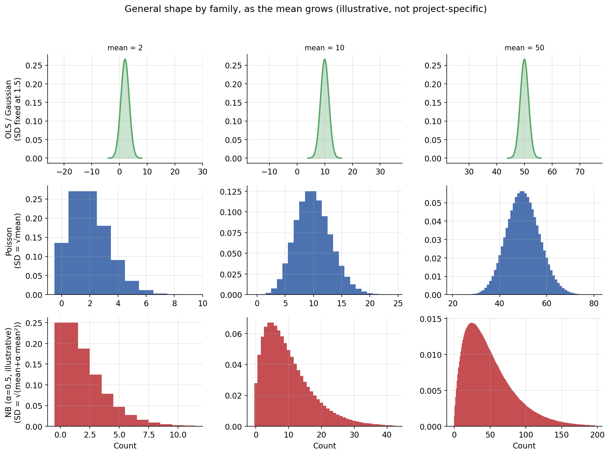

# Choosing a regression model family

*General reference for choosing a model family within the GLM class, used
by any stage in this project that needs one (currently Stages 1 and 2;
see the README). OLS, Poisson, and Negative Binomial (NB) are used as the
running example throughout, though the same framework applies to any
family, e.g. logistic or beta regression.*

An identification strategy (e.g. interrupted time series, comparing
outcomes before and after treatment) is the argument for why a comparison
supports a causal claim; the model family covered here is how that
comparison gets fit numerically. This document only concerns the latter.

## 1. Every family in the GLM class shares the same underlying structure

Generalized Linear Models (GLM) are a model class: a broad group of
regression models sharing a common structure. OLS, Poisson, Negative
Binomial, logistic, and beta regression are each a family within that
class (NB and beta are GLM-adjacent extensions rather than
strict textbook GLMs, but share the same structure and are treated the
same way here). Every family in this class is built from the same three
ingredients:

1. **Linear predictor**: the plain weighted sum of predictors:
   `η[t] = β0 + β1 * t + β2 * Post[t] + β3 * (t * Post[t])`
2. **Link function**: connects the linear predictor `η[t]` to the actual
   predicted mean `μ[t]`, enforcing whatever constraints the outcome has.
3. **Distribution family**: the assumed shape of random scatter around `μ[t]`.

Ingredient 1 is the comparison itself, e.g. before-vs-after treatment, and
comes from the identification strategy, not from this document. Any two
candidates within this class differ *only* in ingredients 2 and 3: the
linear predictor itself (and therefore whatever variables were built from
the data, e.g. `t`, `Post[t]`) stays the same regardless of which family
is ultimately chosen. As a worked example, here's how three common choices
compare:

**Table 1.** The three-ingredient GLM structure, side by side for OLS,
Poisson, and NB.

| Ingredient | OLS | Poisson | NB |
|---|---|---|---|
| Linear predictor | `η[t] = β0 + β1 * t + β2 * Post[t] + β3 * (t * Post[t])` | same | same |
| Link function | Identity: `μ[t] = η[t]` (allows negative values, a flaw for counts) | Log: `μ[t] = exp(η[t])` (always positive) | Log: `μ[t] = exp(η[t])` (always positive) |
| Distribution family | Gaussian around `μ[t]` (Var constant, unrelated to `μ[t]`) | Poisson around `μ[t]` (`Var = μ[t]`) | NB around `μ[t]` (`Var = μ[t] + α*μ[t]²`) |

The same three-row comparison could be built for any other pair or triple,
e.g. logistic regression uses a *logit* link and a Bernoulli distribution,
for a binary outcome instead of a count.

## 2. Every family in the GLM class is fit the same way

Every family in this class is fit by maximum likelihood: finding the
coefficients that make the observed data as probable as possible under the
assumed distribution. For a Gaussian distribution, that turns out to be
mathematically identical to minimising the sum of squared errors, which is
why OLS has a direct, closed-form solution. For Poisson, NB, and most
other distributions, maximising the likelihood does not simplify that
way, so the coefficients are instead found iteratively: an initial guess
is refined step by step until further adjustment stops improving the fit.
The distribution family (ingredient 3) is what decides which of these two
situations applies, not a separate choice made per family.

## 3. Why the link function matters

The **identity link** (OLS) lets predictions be any real number, positive
or negative, which is a problem for a count that can never go below zero.
The **log link** (Poisson and NB) forces `μ[t] = exp(η[t])`, which is always
positive regardless of how negative `η[t]` gets, and turns coefficients
into *multiplicative* effects (e.g. "×50 jump," "13.6% per month") rather
than additive ones, a natural fit for a process that plausibly compounds. Other
links serve the same purpose for other constraints: the *logit* link (used
in logistic regression) keeps predictions inside (0,1) for a binary or
probability outcome.

## 4. Example: choosing between two count families (Poisson vs. NB)

Both use the log link and both are built for counts. The difference is the
**mean–variance relationship**:

- **Poisson** assumes `Variance = Mean` exactly, allowing no flexibility.
- **NB** adds a dispersion parameter `α`, allowing
  `Variance = Mean + α*Mean²`. When `α = 0`, it collapses back to Poisson.

Poisson and NB both start lopsided at a small mean and become bell-shaped at
a large one, the same progression, but NB is visibly wider at every stage,
exactly what its extra `α*Mean²` term adds on top of Poisson's `Mean`. OLS
is shown alongside for contrast: its shape never changes, only its centre
moves, since its variance is fixed regardless of the mean. This chart uses
illustrative means and an illustrative `α`, not this project's fitted
values.

Real count data is very often **overdispersed** (variance exceeds the mean):
bursty periods, batch effects, unmodelled real-world events all add scatter
beyond what pure Poisson randomness allows. Fitting Poisson on overdispersed
data doesn't bias the coefficient estimates much, but it understates their
standard errors, making effects look more statistically significant than
they really are. This is checkable, not a matter of preference: fit NB and
look at whether `α` is estimated as meaningfully greater than zero.

## 5. Decision checklist

This is the generic starting point for identifying a candidate family for
any stage's outcome. Walk down the questions and stop at the first row
that applies, regardless of whether the eventual comparison ends up being
OLS vs. Poisson vs. NB or a different family entirely:

**Table 2.** Decision checklist: which family fits which outcome type.

| Question | Candidate family | Why |
|---|---|---|
| Continuous, roughly symmetric, and can plausibly go negative? | OLS | Its Gaussian noise assumption fits an outcome that's unbounded and symmetric. |
| A count (0, 1, 2, ...) that can't go negative? | Poisson or NB; NB specifically if variance exceeds the mean | Poisson and NB predictions stay non-negative, unlike OLS's; NB is preferred over Poisson when variance exceeds the mean, since Poisson would otherwise understate uncertainty. |
| Binary outcome (two categories, e.g. yes/no)? | Logistic | Its logit link keeps predictions confined to (0,1), unlike a raw linear predictor. |
| Bounded proportion (0–1)? | Binomial / Beta | Keeps predictions inside the valid range, same reasoning as the binary case. |

This checklist narrows the *shortlist*: it identifies which families are
plausible candidates. It is not, by itself, sufficient to declare a winner:
that requires actually fitting the candidates and comparing them; Section
6's Empirical comparison checklist covers exactly that.

## 6. Empirical comparison checklist

Once a shortlist of plausible families exists (typically 2–3, from the
decision checklist above), fit all of them on the same outcome and data
before choosing. For each candidate, record:

1. **Coefficients and their interpretation.** Note whether the model's
   effects are additive (OLS, e.g. "+50 units") or multiplicative
   (Poisson and NB, via the log link, e.g. "×1.5"), these aren't directly comparable
   numbers, which is exactly why steps 2–4 below matter.

   *Does not rank the candidates: this item is for understanding each
   one's effect in its own terms, focusing on the coefficient for the
   causal parameter specifically, not every coefficient in the model.*
2. **AIC** (Akaike Information Criterion, see Glossary). A difference of
   more than ~2 between candidates is usually considered meaningful, not
   noise.

   *The one item of the four that directly ranks the candidates against
   each other.*
3. **An assumption check specific to each candidate.** Watch
   for cases where two candidates share the same assumption rather than
   each having an independent one.

   *A pass/fail check per candidate, not a ranking: a candidate whose own
   assumption does not hold is undermined regardless of how it performs
   on the other items.*

   - **OLS**: the assumption of homoscedasticity, checked via the
     Breusch-Pagan test (see Glossary): whether residual variance stays
     constant as the fitted value changes, matching OLS's own
     constant-variance assumption from Section 1.
   - **Poisson and NB**: share one distributional assumption, the
     mean-variance relationship from Section 1: whether variance exceeds
     the mean, tested via the dispersion test (see Glossary). Treat
     agreement between their two versions of this check as confirmation,
     not two independent pieces of evidence.

   For a different shortlist (e.g. logistic or beta regression), the
   principle is the same even though the specific assumption and test
   aren't: identify which assumptions are genuinely distinct versus which
   candidates are just testing the same thing from different angles, and
   don't double-count the latter.
4. **Residual autocorrelation over time.** The assumption of independence,
   a separate assumption classical inference relies on for valid standard
   errors and p-values, regardless of which family is chosen.

   *A pass/fail check per candidate: if every
   candidate fails it, that is not a tie, it means the issue lies outside
   family choice and needs its own remedy.*

   - **OLS**: the assumption of independence.
   - **Poisson and NB**: also assumes independence; neither family's
     distributional assumption addresses correlated errors over time, so
     this still needs its own check.

   This can be checked two ways: Durbin-Watson (see Glossary) gives a
   single, lag-1-focused number; the autocorrelation function (ACF, see
   Glossary) shows the same diagnostic broken out by lag, useful for
   telling short-memory noise apart from a longer, structural pattern that
   a single Durbin-Watson value can't distinguish.

Recording the four items above for every candidate produces a table like
this:

**Table 3.** Results table template for the four checklist items.

| Candidate | Coefficients | AIC | Assumption check | Autocorrelation check |
|---|---|---|---|---|
| OLS | ... | ... | Breusch-Pagan LM = ..., p = ... | Durbin-Watson = ... |
| Poisson | ... | ... | Pearson chi-squared / df = ... | Durbin-Watson = ... |
| NB | ... | ... | `α` = ..., 95% CI [..., ...] | Durbin-Watson = ... |

**Only after this table is filled in for every candidate** should a model
be selected. The selection should cite the specific numbers that decided
it (e.g. "NB's AIC was X points lower than Poisson's, and its `α`
confidence interval excluded zero").

## 7. Glossary

Sorted alphabetically by term, for lookup.

| Term | Meaning | Other common names |
|---|---|---|
| AIC | A single score for a fitted model's fit-vs-complexity tradeoff; lower is better and it's directly comparable across different distribution families fit on the same outcome | Akaike Information Criterion |
| Autocorrelation function (ACF) | Correlation between a residual series and itself at each lag (1 month apart, 2 months apart, ...), showing whether autocorrelation is short-lived or persists over many months | ACF |
| Breusch-Pagan | A test of whether residual variance stays constant as the fitted value changes (homoscedasticity); a low p-value indicates it doesn't | N/A |
| Coefficient / parameter | A fixed value estimated by the model | N/A |
| Dispersion test | A check of whether real data's variance matches what Poisson assumes (`Variance = Mean`) or exceeds it, via Poisson's Pearson chi-squared/df or NB's `α` confidence interval | Overdispersion test |
| Distribution family | Ingredient 3 of the GLM structure: the assumed shape of random scatter around `μ[t]` (e.g. Gaussian, Poisson, NB) | N/A |
| Durbin-Watson | A statistic (roughly 0-4) testing whether a model's residuals are independent over time; near 2 means independent, near 0 or 4 means strongly correlated | N/A |
| Error term (`ε`) | True, unobservable gap from the real process | Disturbance term |
| Family | A specific distribution-and-link choice within a model class (e.g. Poisson and NB) | N/A |
| Linear predictor (`η`) | The unconstrained weighted sum of predictors | Systematic component |
| Link function | Connects the linear predictor to the predicted mean | N/A |
| Mean-variance relationship | The variance implied by a family's distribution family, not an independent choice (e.g. Poisson's `Var = μ[t]` follows directly from assuming `Y[t]` is Poisson-distributed) | N/A |
| Model | A family fitted to specific data with specific predictors and estimated coefficients | Fitted model |
| Model class | A broad group of regression models sharing a common structure (e.g. GLM) | Modelling framework |
| Outcome | The variable being predicted | Dependent variable, response, target |
| Overdispersion | Variance exceeding what the simpler distribution in a pair allows (e.g. Poisson) | N/A |
| Residual | Observed gap from the *fitted* model | Estimated error (`ε̂`) |
| Variable | Has a different value at every row/time point | N/A |
