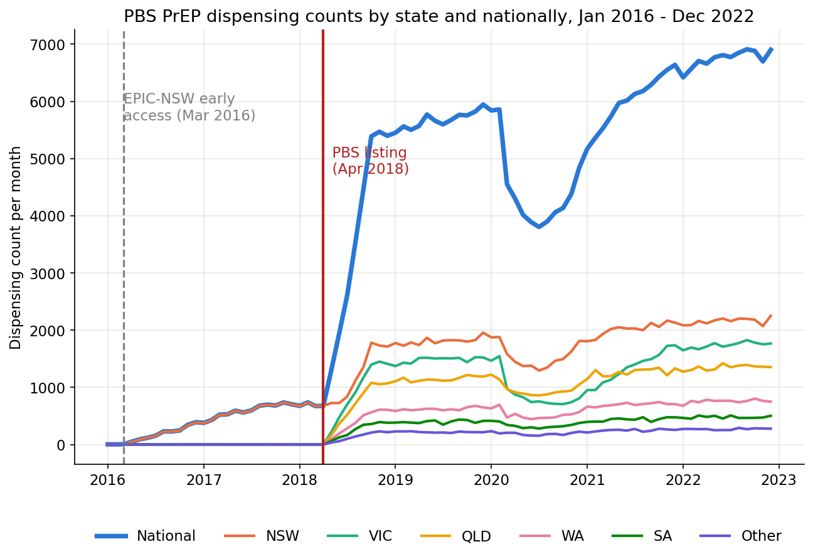
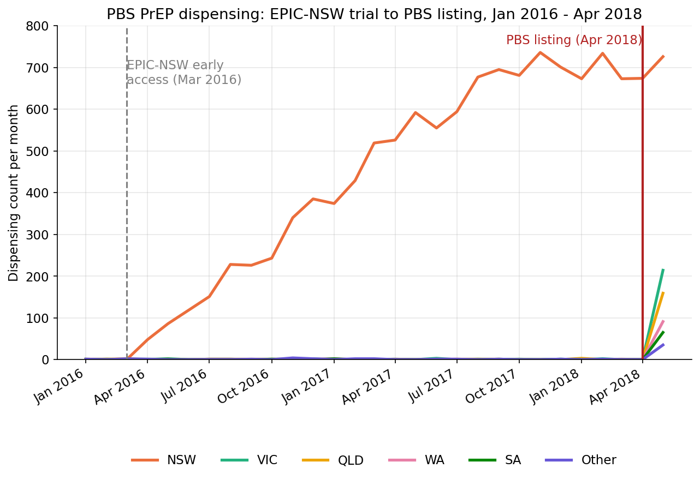

# Did PBS-subsidised PrEP reduce new HIV diagnoses in Australia?

*A causal inference case study using Australian PrEP listing and HIV surveillance data*

## The project in one paragraph

On 1 April 2018, Australia's Pharmaceutical Benefits Scheme (PBS) began subsidising
HIV pre-exposure prophylaxis (PrEP), cutting the cost from several hundred dollars a
month to around $40. This project asks whether that policy change caused a measurable
reduction in new HIV diagnoses, beyond trends that were already underway, and uses the
episode to demonstrate a full causal-inference workflow: from a simple before/after
check through to a staggered-adoption difference-in-differences design.

## Background and the PBS item codes involved

PrEP is the co-formulated antiretroviral tenofovir disoproxil + emtricitabine, sold
under the brand name Truvada and, since patent expiry, under several generic brands.
On the PBS, these are listed as **Restricted Benefit** items with the indication
*"Pre-exposure prophylaxis (PrEP) against human immunodeficiency virus (HIV)
infection"*, for example item **11296M** (tenofovir disoproxil 300 mg + emtricitabine
200 mg, 30 tablets, Viatris/Alphapharm brand), alongside equivalent items for other
brands and pack sizes (e.g. 12542D). This PrEP-specific restriction is what
distinguishes these dispensings from tenofovir/emtricitabine prescribed for
*treating* existing HIV infection, which sits under a separate item and restriction.

The **Kirby Institute** (UNSW Sydney) publishes its own "Monitoring HIV PrEP uptake in
Australia" series using this same PBS-restriction logic. It draws on every
PBS-subsidised PrEP prescription dispensed since 1 April 2018, identified via the
PrEP-specific restricted-benefit item codes rather than by drug name alone, and
provides an external check for anyone extracting the same item codes from the raw
PBS Item Reports on data.gov.au. The raw PBS Item Report extract used for this
project (`data/raw/pbs-dispensing-data/PBS_Data_2103987483.7.xls`) shows about
59,600 PrEP dispensing services nationally in the first nine months after listing
(April to December 2018), rising from a standing start.

## Causal question and design

**Primary question:** did the PBS listing of PrEP cause a reduction in new HIV
diagnoses in Australia, beyond the pre-existing downward trend?

The analysis builds in four stages of increasing rigour, the last of which is
optional:

1. **Interrupted time series on PrEP dispensing**, a sanity-check step. The level
   shift at April 2018 is large and unambiguous, so this mainly demonstrates a clean
   segmented regression before tackling the harder outcome question.
2. **Difference-in-differences on HIV notifications**, comparing diagnoses attributed
   to male-to-male sexual contact (the population PrEP overwhelmingly targets)
   against diagnoses attributed to other transmission categories, which act as a
   control group unaffected by PrEP availability but exposed to the same general
   trends in testing and awareness.
3. **Staggered-adoption analysis across states**, exploiting the fact that New South
   Wales ran a large PrEP demonstration trial (EPIC-NSW) from 2016, effectively
   receiving the intervention roughly two years before the rest of the country. This
   supports a more modern staggered-DiD approach, similar in spirit to estimators
   such as Callaway and Sant'Anna, and avoids the "bad comparisons" problem that
   affects naive two-way fixed-effects estimators when treatment timing varies
   across units.
4. **Causal forest heterogeneity analysis (optional)**, using the state-level
   covariates described below to test whether the PrEP effect varied by state, for
   example due to uneven COVID-19 disruption.

## Phase 1 data acquisition: what was attempted with real-world data

Before settling on synthetic data, a genuine attempt was made to source and validate
both halves of the causal chain from public real-world data. This phase surfaced two
distinct, unresolved data-availability problems: one on the treatment (PBS dispensing)
side, and one on the outcome (HIV notifications) side, that together motivated the
switch to synthetic data.

### PBS item code identification and verification

PrEP dispensing on the PBS is not tracked under a single item code. Multiple brands
and pack sizes of tenofovir disoproxil + emtricitabine are each assigned their own
code, and the PBS item drug map returned **six item codes** carrying the PrEP-specific
restricted-benefit indication. Each code was checked against PBS Schedule history
(monthly schedule snapshots, searched across a widened window of January 2017 to June
2026) to confirm both that it was genuinely PrEP-restricted (as opposed to an
HIV-*treatment* item under the same drug name) and to establish its listing date:

- **11276L and 11296M** were both confirmed with a listing date of **April 2018**,
  directly corroborating the project's assumed treatment date and giving external
  validation that the PBS listing date used throughout the design is correct.
- **12542D** was confirmed with a later listing date of **June 2021**, consistent with
  a new generic brand entering the market well after the original listing.
- **15366R, 15383P, and 15410C** (the remaining three codes flagged as PrEP-restricted
  in the drug map) could not be found in the PBS Schedule history at all, despite the
  widened search window. Cross-referencing PBS item groupings suggested item code
  families are periodically restructured (older codes superseded by new ones as brands
  are added or schedules are reorganised), which is the most likely explanation,
  though it could not be confirmed conclusively without direct access to PBS change
  logs for those specific codes. Since the two priority checks (confirming the
  April 2018 treatment date and identifying materially-volumed codes) were already
  satisfied by the three confirmed codes, further reconciliation of these three was
  deprioritised rather than allowed to block the project.

### Difficulty obtaining pre-2019 HIV notification data

The outcome side proved harder to resolve. The project design requires **quarterly**
HIV notification counts by state and transmission category, with several years of
pre-treatment history (back to at least 2013–2016) needed to test the parallel-trends
assumption underpinning the difference-in-differences design.

- The **NNDSS extract on data.gov.au** was only available from **Q1 2019** onward.
- Investigating further, this was found to reflect a genuine feature of how the data
  is collected nationally, not a download or access fault: Kirby Institute's own
  quarterly, exposure-category-stratified HIV reporting series (corroborated by a
  Health Equity Matters summary of the same series) confirms that this level of
  aggregate quarterly detail (broken down by jurisdiction, exposure category, age,
  and other fields) was **only introduced starting Q1 2019**. Before that date,
  equivalent exposure-category detail exists only at **annual** resolution, published
  in Kirby's Annual Surveillance Reports as PDF tables rather than machine-readable
  data.
- This left no way to build a genuinely quarterly, exposure-stratified notification
  series spanning both sides of the April 2018 treatment date from public sources.
  The pre-period would have had to be annual while the post-period was quarterly, an
  asymmetry that would complicate the diff-in-diff and staggered-adoption designs
  considerably, and the annual PDF tables would still have required substantial manual
  extraction effort to assemble even at that coarser resolution.

### Why this led to synthetic data

With the treatment-date evidence already secured (via the PBS Schedule verification
above) but no clean path to a full quarterly pre/post outcome series, the project
switched to generating **synthetic data with the same structure and known, built-in
effects**, described below, so that the full causal-inference workflow (the quarterly
resolution and multi-year pre-period the real data couldn't supply) could still be
built and validated end-to-end against a known ground truth.

## Visual check: does the dispensing data show the expected level shift?

This chart corresponds to Stage 1 of the design above, the interrupted time series
sanity check. Before running any regression, it's worth just looking at the raw
dispensing series: does the data actually show the large, obvious level shift the
project's causal argument depends on? It does. National dispensing sits below 750 a
month through 2016–17, then rises roughly eightfold in the first six months after the
April 2018 listing, settling around 5,500–6,000 a month by 2019. Two further patterns
are visible without any modelling:

- **A clear COVID-19 dip.** National dispensing falls from ~5,900 to ~3,800 a month
  during 2020, with the slowest recovery in Victoria, consistent with that state's
  extended lockdowns, and a useful secondary natural experiment also discussed in
  `docs/scope_and_rationale.md`.
- **NSW is already elevated before the national listing.** Its line separates from
  the other states well before April 2018, which is the first visual hint that the
  "before" period isn't as flat as a simple before/after comparison would assume.
  This is addressed in more detail below.

## Data used, and why it's synthetic

The design calls for two linked datasets: monthly PBS PrEP dispensing counts by state,
and quarterly HIV notification counts by state and transmission category, plus
state-level covariates for heterogeneity analysis. The real-world equivalents exist
(PBS Item Reports and NNDSS/Kirby surveillance data are both public), but for this
project we generated **synthetic data with the same structure and known,
built-in effects**, for two reasons:

- It lets the causal-inference code be checked against a **known ground truth**
  (an effect we deliberately put in) rather than an unknown real effect, which is
  the standard way to validate that an estimator is working correctly before
  trusting it on real data.
- It avoids the extra step of reconciling multiple public data extracts (PBS item
  filters, NNDSS category definitions, state boundaries) before any modelling could
  start, while still letting the workflow, charts, and regressions be built and
  tested end-to-end.

### How the synthetic data was built

A single generator script produces all three files from a fixed random seed, so the
data is reproducible:

- **PBS dispensing** (`pbs_dispensing_monthly.csv`): each state's monthly dispensing
  count combines an early ramp for NSW from 2016 (EPIC-NSW), a large level shift and
  ramp-up for all states from April 2018, and a COVID-era dip in 2020 that is deepest
  and longest in Victoria, then adds realistic Poisson noise.
- **HIV notifications** (`hiv_notifications_quarterly.csv`): each state/category/
  quarter combines a mild shared secular decline, a PrEP-driven reduction applied
  only to the MSM category from each state's own treatment start date (2016 for NSW,
  2018 for the rest), and a shared 2020 testing-disruption dip, calibrated so the
  national annual total tracks anchor figures of 1,028 diagnoses in 2015 and 838 in
  2018. These are close to, but not identical to, the real totals in the raw NNDSS
  extract used for this project
  (`data/raw/hiv_notification_data/hiv_notifications_data_by_hiv_exposure.csv`),
  which sum to 1,030 in 2015 and 840 in 2018.
- **State covariates** (`state_covariates.csv`): static, plausible state-level figures
  (population, MSM population proxy, socioeconomic index, testing rates, lockdown
  severity, EPIC-NSW early-access flag) for the optional heterogeneity analysis.

## Quality assurance performed on the synthetic data

Generating data with a known effect is only useful if that effect is represented
correctly, so the synthetic output was checked against the intended story and two
issues were found and corrected:

1. **An artificial one-month dip in national PrEP dispensing at exactly April 2018.**
   The original formula switched NSW's pre-listing trial dispensing off in the same
   month the post-listing ramp started at zero, so a real, ongoing cohort of trial
   participants briefly disappeared from the data, a modelling artifact, not a real
   phenomenon (people don't stop taking PrEP the month a subsidy mechanism changes).
   This was fixed by treating the trial-era dispensing as a floor that the new ramp
   grows past, rather than a switch that turns off.
2. **Hidden coupling between the two datasets' randomness.** Both files were
   originally drawn from a single shared random-number stream, so a fix to the PBS
   dispensing logic silently changed the unrelated HIV notification numbers too. The
   generator was refactored to use independent random streams per dataset, and the
   national annual HIV total was recalibrated against the anchor figures described
   above (now 1,034 and 820 against targets of 1,028 and 838, versus 1,066 and 889
   before).

Two further observations were logged for the analysis stage rather than changed in
the data, since they reflect genuine features of the staggered-rollout design rather
than errors:

- NSW's early EPIC-NSW dispensing means the *national* pre-2018 baseline is not
  strictly "near zero," which will bias a naive single-break national segmented
  regression. This is the reason the staggered-adoption design (Stage 3) exists,
  rather than a defect to remove.
- NSW's trial-era dispensing floor is capped and held constant going forward; this is
  inert under current parameters but would need revisiting if the post-listing scale
  parameter were substantially reduced in a future version.

### A closer look at the NSW pre-trend

The chart above zooms into exactly the window flagged in the QA notes: January 2016 to
April 2018, on a y-axis scaled to the pre-listing range rather than the full national
scale (where these numbers would be flattened near zero). Two things stand out:

- **NSW's rise is not a fluke of the generator. It is the intended EPIC-NSW signal.**
  Dispensing climbs steadily from 0 to roughly 670–730 a month over two years,
  entirely before the national PBS listing, while every other state stays at
  essentially zero across the same period.
- **This is exactly why Stage 1's naive interrupted time series needs a caveat, and
  why Stage 3 exists.** A single national break test at April 2018 would attribute
  some of NSW's already-established upward trend to the listing itself. Treating NSW
  as an earlier-treated unit (from 2016) and the rest of the country as later-treated
  (from 2018), a staggered-adoption design, is the more defensible way to use this
  same data, and this chart is the clearest single piece of evidence for why.

## Status

Synthetic data generation, verification, and the dispensing-side interrupted time
series visualisation are complete. The difference-in-differences and staggered-
adoption analyses on HIV notifications are next; the optional causal forest
heterogeneity analysis follows.
