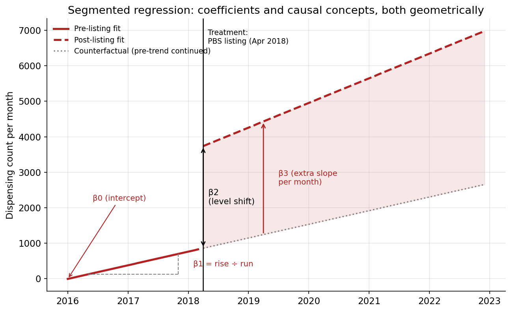
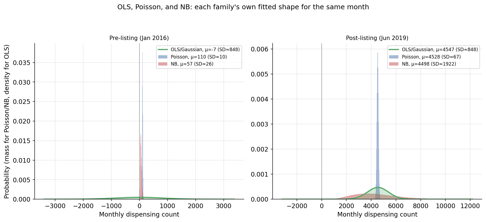
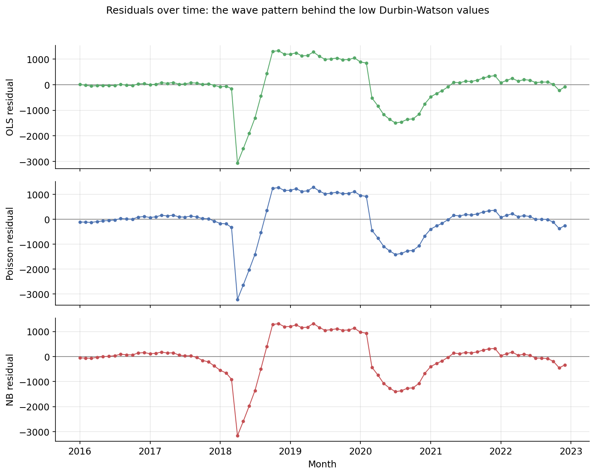
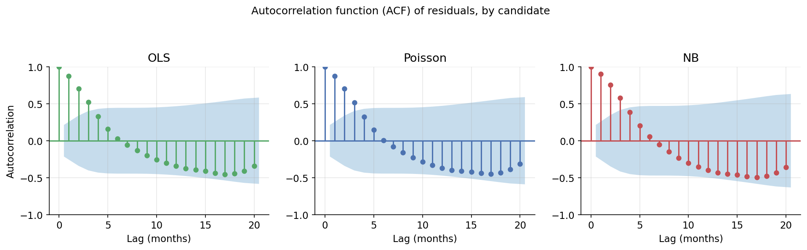

# Stage 1: Interrupted time series on PrEP dispensing

Sanity-check step in the project's four-stage causal design: using interrupted time
series as the identification strategy (see `docs/scope_and_rationale.md`), does
national PBS PrEP dispensing show the level shift the project's causal argument
depends on, and is a simple national break test even valid here?

## What is an interrupted time series, and why use it here?

Interrupted time series (ITS) is an identification strategy: it argues that if an
outcome measured repeatedly over time visibly breaks, a jump in level, a change in
slope, or both, exactly when a specific event happened, that event most plausibly
caused the break. It compares the outcome's trajectory before the event against its
trajectory after; the pre-period trend stands in for the counterfactual, what the
outcome would plausibly have kept doing without the intervention. Here, the event is
the 1 April 2018 PBS listing and the outcome is national monthly PrEP dispensing:
Stage 1 asks whether dispensing itself broke sharply at that date.

**Strength.** ITS needs only one time series and a known intervention date; no
matched comparison group is required. (A "control group" implies random assignment;
since nothing in this project is randomly assigned, "comparison group" is the more
accurate term used throughout.) It suits policy changes that affect an entire
population at once, such as a PBS listing, where a comparison group is hard or
impossible to construct.

**Pros:**

- Works with a single series and no comparison group, useful when everyone is
  treated at once.
- The identifying logic is visible in the same chart used to argue for it: a reader
  can see the break directly.
- Detects both an immediate level change and a change in the underlying trend, not
  just an average before/after difference.

**Cons:**

- Vulnerable to any other event coinciding with the intervention date, e.g. a
  different policy or a seasonal effect, since there is no comparison group to net
  that out.
- Needs a long enough pre-period to establish what the trend was actually doing
  beforehand; a short or noisy pre-period weakens the counterfactual.
- Assumes the functional form (here, linear pre- and post-trends) is correct; a
  genuine nonlinear trend can be mistaken for a level shift, or vice versa.
- A single national break test can misattribute an already-underway regional trend
  to the national-level event, addressed for this project's own case in
  `reports/pbs_prep_dispensing_data_exploration.md`.

Because of these limitations, particularly the missing comparison group and the risk
of misattributing a regional trend, this project's four-stage causal design (see
`docs/scope_and_rationale.md`) treats Stage 1 as a sanity check rather than the final
causal claim: ITS on its own establishes that dispensing changed sharply at the right
moment, which is necessary but not sufficient to argue the PBS listing caused a
downstream reduction in HIV diagnoses.

## Model specification

Stage 1 fits a segmented (piecewise-linear) regression, the standard design for an
interrupted time series. Its linear predictor, shared across every candidate family
considered in Model family selection below regardless of which one ultimately gets
selected (see `docs/model_family_concepts.md`, Section 1), is:

```
η[t] = β0 + β1 * t + β2 * post_listing[t] + β3 * months_since_post_listing[t]
```

where:
- `η[t]`: the linear predictor for month t; how it maps to the actual predicted
  dispensing count depends on which family's link function is used.
- `t`: a running month index, 0, 1, 2, ..., 83 (January 2016 = 0).
- `post_listing[t]`: 1 if month t falls on or after April 2018, 0 otherwise.
- `months_since_post_listing[t]`: `post_listing[t] * (t - t at the first post-listing month)`,
  so it counts 0, 1, 2, ... after listing and stays at 0 throughout the pre-period.

Coefficients:

- `β0`: fitted dispensing level at the start of the series (January 2016).
- `β1`: pre-existing linear trend: the change in dispensing per month before the listing.
- `β2`: level shift: the immediate jump in dispensing at treatment (April 2018)
- `β3`: change in slope after treatment, so the post-period trend equals β1 + β3.

**Table 1.** Causal concepts mapped to this design's specification.

| Causal concept | What it is in this design |
|---|---|
| Treatment | The 1 April 2018 PBS listing |
| Treated unit | The single national dispensing series (not a group compared against a separate group) |
| Comparison group | Not used in this design; ITS relies on the treated unit's own extrapolated pre-trend instead. Stage 2 uses one |
| Counterfactual | The pre-listing trend extrapolated forward: what dispensing would have been without the listing |
| Treatment effect | The gap between observed post-listing dispensing and the counterfactual: β2 at the listing date, growing by β3 each month after |



Each coefficient corresponds to a distinct visual feature of the segmented
regression: `β0` is where the pre-listing line meets t=0; `β1` is that line's
slope; `β2` is the vertical jump at the listing date, the gap between where the
pre-listing trend would have landed and where the post-listing line actually
starts; `β3` is the extra slope added after the listing. The grey dotted line is
the counterfactual from Table 1, the pre-listing trend extended forward as if
the listing had not happened; the shaded gap between it and the observed
post-listing line is the treatment effect, β2 immediately and growing by β3
every month after. This chart uses OLS's fit specifically to draw the
geometry, but what each term means structurally is the same regardless of
which family ultimately estimates it.

**Why β2, specifically, is the causal parameter.** The identification strategy
(interrupted time series) argues that a comparison of dispensing immediately before
and after the listing supports a causal claim, provided nothing else plausibly
changed at exactly that date (see the "Threat to identification" for this stage in
`docs/scope_and_rationale.md`). β2 is the coefficient that captures exactly that
before/after comparison, regardless of which family estimates it; β0, β1, and β3
describe the surrounding trend but don't measure the discontinuity itself. This is
why the empirical comparison in Model family selection below is made on β2
specifically, not on every coefficient.

## Model family selection

The Decision checklist in `docs/model_family_concepts.md` identifies Poisson and NB
as the plausible candidates for a non-negative count outcome; OLS is included
alongside them as a baseline, not because the checklist selects it. Choosing among
the three requires the Empirical comparison checklist (Section 6): fit all three
on the same specification and work through its four items in turn.

**Table 2.** Empirical comparison checklist results (Section 6), for all three
candidates fitted on the specification in Model specification above.

| Candidate | Coefficients (β2) | AIC | Assumption check | Autocorrelation check |
|---|---|---|---|---|
| OLS | +2,877.9 (additive) | 1,375.0 | Breusch-Pagan LM = 37.29, p < 0.001 | Durbin-Watson = 0.255 |
| Poisson | ×3.57 (multiplicative) | 17,602.3 | Pearson chi-squared / df = 178.92 | Durbin-Watson = 0.250 |
| NB | ×2.13 (multiplicative) | 1,387.2 | α = 0.1823, 95% CI [0.1228, 0.2419] | Durbin-Watson = 0.190 |

**1. Coefficients and their interpretation.** The coefficient values aren't directly comparable, since OLS's β2 is additive and Poisson's and NB's are multiplicative.

**2. AIC.**

1. **OLS**: rank 1 (1,375.0).
2. **Poisson**: rank 3 (17,602.3, 16,227.3 points higher than OLS,
   decisively ruled out).
3. **NB**: rank 2 (1,387.2, 12.2 points higher than OLS).

The OLS-NB gap exceeds the ~2-point threshold usually considered meaningful, so
this item ranks OLS ahead of NB, with Poisson decisively ruled out.

**3. An assumption check specific to each candidate.**

1. **OLS**: fail (Breusch-Pagan LM = 37.29, p < 0.001).
2. **Poisson**: fail (Pearson chi-squared / df = 178.92).
3. **NB**: pass (α = 0.1823, 95% CI [0.1228, 0.2419]).

OLS's residual variance depends on `t`, `post_listing`, and
`months_since_post_listing` rather than staying constant (Breusch-Pagan
p < 0.001, well below the conventional 0.05 threshold), contradicting its
own assumption.

Poisson's dispersion ratio of 178.92 is far above the 1.0 expected if
variance genuinely equalled the mean, contradicting its own assumption just
as decisively.

NB's own assumption, that the extra dispersion its `α` term captures is real
rather than zero, is confirmed: its 95% confidence interval, [0.1228, 0.2419],
excludes zero.



The three numbers above are what this chart draws out: in June 2019, OLS's
fixed spread (SD≈848) sits far narrower than NB's own (SD≈1,922), while
Poisson's (SD≈67) is narrower still, visibly too tight for the real scatter
in the data.

**4. Residual autocorrelation over time.**

1. **OLS**: fail (Durbin-Watson = 0.255).
2. **Poisson**: fail (Durbin-Watson = 0.250).
3. **NB**: fail (Durbin-Watson = 0.190).

All three sit far from the 2 that would indicate independent residuals, and
close to 0, strong positive autocorrelation. Since every candidate fails,
the issue lies outside family choice: no choice among OLS, Poisson, and NB
fixes it, it needs its own remedy rather than a different family.



Figure 3 shows why: residuals from all three candidates trace nearly the
same wave, an undershoot at the April 2018 listing, a swing above zero
through 2019, a deep dip through the 2020 COVID period, and a partial
recovery after, not random scatter.



Figure 4 breaks that wave down by lag. OLS's residuals, the other two look
the same, stay positively correlated out to about lag 5-6 (lag 1 = +0.87),
then swing to significant negative correlation from around lag 8, bottoming
out near −0.46 around lag 17. Durbin-Watson only reflects lag 1, so it
can't tell short-lived noise apart from a long, structural pattern, and
this is the latter: a trough at the April 2018 listing, a peak about 7
months later (November 2018), and the COVID trough about 20 months after
that (July 2020) are exactly what the shift to negative correlation at
longer lags is picking up. That's independent evidence the autocorrelation
reflects specific omitted structure, not a short-memory noise process any
family choice could fix.

**Family selection: deferred.** AIC currently favours OLS, but OLS fails its
own homoscedasticity assumption; NB passes its own assumption but loses
decisively on AIC; and all three fail the autocorrelation check identically,
for the same underlying reason. With the dominant signal across all four
items pointing at omitted structure in the specification rather than a
genuine difference between the candidates, selecting a family now would be
premature. The next step is fixing the specification, a COVID-period term
and the non-linear post-listing growth are the leading candidates, and
re-running this checklist before a family is chosen.
