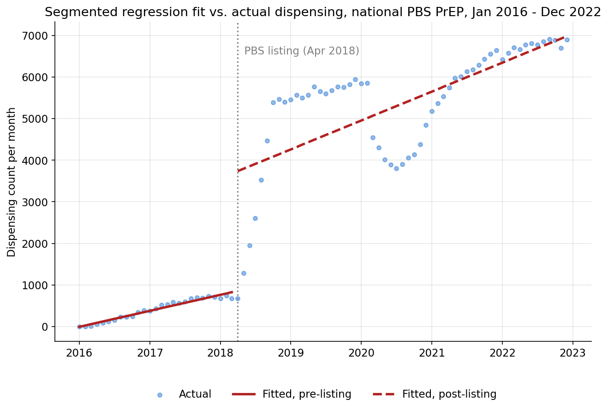
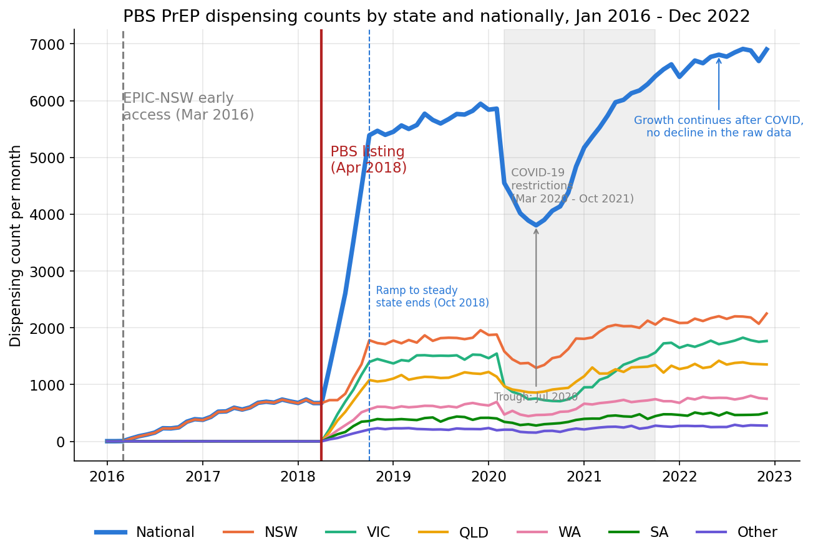
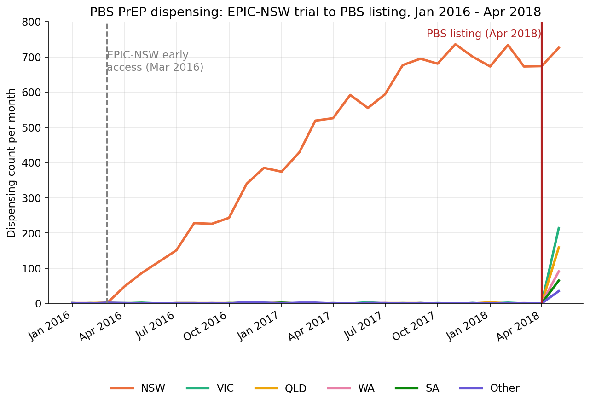

# Stage 1: Interrupted time series on PrEP dispensing

Sanity-check step in the project's four-stage causal design: using interrupted time
series as the identification strategy (see `docs/scope_and_rationale.md`), does
national PBS PrEP dispensing show the level shift the project's causal argument
depends on, and is a simple national break test even valid here?

## What is an interrupted time series, and why use it here?

Interrupted time series (ITS) is an identification strategy: it argues that if an
outcome measured repeatedly over time visibly breaks, a jump in level, a change in
slope, or both, exactly when a specific event happened, that event most plausibly
caused the break. It compares the outcome's trajectory before the event against its
trajectory after; the pre-period trend stands in for the counterfactual, what the
outcome would plausibly have kept doing without the intervention. Here, the event is
the 1 April 2018 PBS listing and the outcome is national monthly PrEP dispensing:
Stage 1 asks whether dispensing itself broke sharply at that date.

**Strength.** ITS needs only one time series and a known intervention date; no
matched comparison group is required. (A "control group" implies random assignment;
since nothing in this project is randomly assigned, "comparison group" is the more
accurate term used throughout.) It suits policy changes that affect an entire
population at once, such as a PBS listing, where a comparison group is hard or
impossible to construct.

**Pros:**

- Works with a single series and no comparison group, useful when everyone is
  treated at once.
- The identifying logic is visible in the same chart used to argue for it: a reader
  can see the break directly.
- Detects both an immediate level change and a change in the underlying trend, not
  just an average before/after difference.

**Cons:**

- Vulnerable to any other event coinciding with the intervention date, e.g. a
  different policy or a seasonal effect, since there is no comparison group to net
  that out.
- Needs a long enough pre-period to establish what the trend was actually doing
  beforehand; a short or noisy pre-period weakens the counterfactual.
- Assumes the functional form (here, linear pre- and post-trends) is correct; a
  genuine nonlinear trend can be mistaken for a level shift, or vice versa.
- A single national break test can misattribute an already-underway regional trend
  to the national-level event, addressed for this project's own case below.

Because of these limitations, particularly the missing comparison group and the risk
of misattributing a regional trend, this project's four-stage causal design (see
`docs/scope_and_rationale.md`) treats Stage 1 as a sanity check rather than the final
causal claim: ITS on its own establishes that dispensing changed sharply at the right
moment, which is necessary but not sufficient to argue the PBS listing caused a
downstream reduction in HIV diagnoses.

## Model specification

Stage 1 fits a segmented (piecewise-linear) regression, the standard design for an
interrupted time series:

```
dispensing[t] = β0 + β1 * t + β2 * post_listing[t] + β3 * months_since_post_listing[t] + ε[t]
```

where:
- `dispensing[t]`: national PrEP dispensing count in month t.
- `t`: a running month index, 0, 1, 2, ..., 83 (January 2016 = 0).
- `post_listing[t]`: 1 if month t falls on or after April 2018, 0 otherwise.
- `months_since_post_listing[t]`: `post_listing[t] * (t - t at the first post-listing month)`,
  so it counts 0, 1, 2, ... after listing and stays at 0 throughout the pre-period.
- `ε[t]`: the error term

Coefficients:

- `β0`: fitted dispensing level at the start of the series (January 2016).
- `β1`: pre-existing linear trend: the change in dispensing per month before the listing.
- `β2`: level shift: the immediate jump in dispensing at treatment (April 2018)
- `β3`: change in slope after treatment, so the post-period trend equals β1 + β3.

**Table 1.** Causal concepts mapped to this design's specification.

| Causal concept | What it is in this design |
|---|---|
| Treatment | The 1 April 2018 PBS listing |
| Treated unit | The single national dispensing series (not a group compared against a separate group) |
| Comparison group | Not used in this design; ITS relies on the treated unit's own extrapolated pre-trend instead. Stage 2 uses one |
| Counterfactual | The pre-listing trend extrapolated forward: what dispensing would have been without the listing |
| Treatment effect | The gap between observed post-listing dispensing and the counterfactual: β2 at the listing date, growing by β3 each month after |


Each coefficient corresponds to a distinct visual feature of the segmented
regression: `β0` is where the pre-listing line meets t=0; `β1` is that line's
slope; `β2` is the vertical jump at the listing date, the gap between where the
pre-listing trend would have landed and where the post-listing line actually
starts; `β3` is the extra slope added after the listing. The grey dotted line is
the counterfactual from Table 1, the pre-listing trend extended forward as if
the listing had not happened; the shaded gap between it and the observed
post-listing line is the treatment effect, β2 immediately and growing by β3
every month after. This is the same fitted model shown with its actual data in
Figure 2 below; the framing here is structural, what each term in the equation
means geometrically, before the "Regression results" section reports the
fitted values themselves.

## Model family selection

The Decision checklist in `docs/model_family_concepts.md` identifies Poisson and NB
as the plausible candidates for a non-negative count outcome; OLS is included
alongside them as a baseline, not because the checklist selects it. Choosing among
the three requires the Empirical comparison checklist (Section 6): fit all three
on the same specification and work through its four items in turn, filled in
below as each is completed.

**Table 2.** Empirical comparison checklist results (Section 6), for all three
candidates fitted on the specification in Model specification above.

| Candidate | Coefficients (β2) | AIC | Assumption check | Autocorrelation check |
|---|---|---|---|---|
| OLS | +2,877.9 (additive) | 1,375.0 | Breusch-Pagan LM = 37.29, p < 0.001 | *Pending* |
| Poisson | ×3.57 (multiplicative) | 17,602.3 | Pearson chi-squared / df = 178.92 | *Pending* |
| NB | ×2.13 (multiplicative) | 1,387.2 | α = 0.1823, 95% CI [0.1228, 0.2419] | *Pending* |

**1. Coefficients and their interpretation.** The coefficient values aren't directly comparable, since OLS's β2 is additive and Poisson's and NB's are multiplicative.

**2. AIC.**

1. **OLS**: rank 1 (1,375.0).
2. **Poisson**: rank 3 (17,602.3, 16,227.3 points higher than OLS,
   decisively ruled out).
3. **NB**: rank 2 (1,387.2, 12.2 points higher than OLS).

The OLS-NB gap exceeds the ~2-point threshold usually considered meaningful, so
this item ranks OLS ahead of NB, with Poisson decisively ruled out.

**3. An assumption check specific to each candidate.**

1. **OLS**: fail (Breusch-Pagan LM = 37.29, p < 0.001).
2. **Poisson**: fail (Pearson chi-squared / df = 178.92).
3. **NB**: pass (α = 0.1823, 95% CI [0.1228, 0.2419]).

OLS's residual variance depends on `t`, `post_listing`, and
`months_since_post_listing` rather than staying constant (Breusch-Pagan
p < 0.001, well below the conventional 0.05 threshold), contradicting its
own assumption.

Poisson's dispersion ratio of 178.92 is far above the 1.0 expected if
variance genuinely equalled the mean, contradicting its own assumption just
as decisively.

NB's own assumption, that the extra dispersion its `α` term captures is real
rather than zero, is confirmed: its 95% confidence interval, [0.1228, 0.2419],
excludes zero.


The three numbers above are what this chart draws out: in June 2019, OLS's
fixed spread (SD≈848) sits far narrower than NB's own (SD≈1,922), while
Poisson's (SD≈67) is narrower still, visibly too tight for the real scatter
in the data.

## Model fitting

*Provisional from here through "Interpreting the coefficients and identifying the
causal parameter": OLS is used below because it currently leads on AIC in Model
family selection above, not because a family has been settled on. These sections
will be revisited once that section's assumption check and autocorrelation check are
done.*

The coefficients are estimated by ordinary least squares
(`smf.ols(...).fit()` in
[`src/analysis/01_interrupted_time_series.py`](../src/analysis/01_interrupted_time_series.py)),
minimising the sum of squared residuals. Standard errors use the classical
(nonrobust) formula, and each p-value comes from comparing the coefficient's
t-statistic against a t-distribution with 80 degrees of freedom (84 months minus 4
parameters). Note that this assumes independent errors; the regression's own
Durbin-Watson statistic (0.255) indicates strong positive autocorrelation in monthly
residuals, so these p-values are likely optimistic and would tighten under
autocorrelation-robust (HAC) standard errors.

## Regression results

**Table 3.** OLS estimates for the four coefficients in the specification above.

| Term | Coefficient | Std. error | p-value |
|---|---|---|---|
| Intercept (β0) | -7.2 | 317.4 | 0.982 |
| Pre-period trend (β1, per month) | 32.1 | 20.9 | 0.130 |
| **Level shift at listing (β2)** | **2,877.9** | 402.1 | **< 0.001** |
| Post-period trend change (β3, per month) | 25.8 | 22.0 | 0.244 |

N = 84 months, R² = 0.897. The level shift at the listing date is large and highly
significant: national dispensing jumps by around 2,878 a month at April 2018, holding
the pre-existing trend constant. The pre- and post-period trend terms are not
significant on their own, consistent with the shift being a genuine step change
rather than a gradual acceleration.

## Interpreting the coefficients and identifying the causal parameter



Each coefficient in `dispensing[t] = β0 + β1·t + β2·post_listing[t] +
β3·months_since_post_listing[t] + ε[t]` answers a different question about the
series:

- **β0 (intercept, -7.2, not significant)**: the fitted dispensing level at t=0
  (January 2016). Not meaningful on its own; dispensing was genuinely near zero
  before the trial and listing began, so a fitted intercept near zero is expected,
  not a finding.
- **β1 (pre-period trend, 32.1 dispensings/month, p=0.130)**: how fast national
  dispensing was already rising before the listing, driven mostly by NSW's early
  EPIC-NSW access. Not statistically significant on its own, consistent with
  pre-listing dispensing being small and only slowly rising nationally.
- **β2 (level shift, 2,877.9 dispensings, p<0.001)**: the immediate jump in
  dispensing at the April 2018 listing, holding the pre-existing trend constant.
  **This is the causal parameter of interest.** It is what Stage 1 exists to
  estimate: does dispensing itself move sharply at the moment PrEP became
  subsidised? At 2,877.9 and highly significant, the answer is unambiguously yes.
- **β3 (post-period trend change, 25.8 dispensings/month, p=0.244)**: whether the
  monthly growth rate itself changed after the listing, on top of the one-time
  jump. Not significant here, consistent with the level shift being a step change
  rather than an accelerating trend.

**Why β2, specifically, is the causal parameter.** The identification strategy
(interrupted time series) argues that a comparison of dispensing immediately before
and after the listing supports a causal claim, provided nothing else plausibly
changed at exactly that date (see the "Threat to identification" for this stage in
`docs/scope_and_rationale.md`). β2 is the coefficient that captures exactly that
before/after comparison, regardless of which family estimates it; β0, β1, and β3
describe the surrounding trend but don't measure the discontinuity itself. This is
also why the empirical comparison in Model family selection above is made on β2
specifically, not on every coefficient.

**Residual error, ε[t].** ε[t] is what the model does not explain: the gap between
each month's actual dispensing and the value the fitted equation predicts for that
month. OLS assumes these residuals are independent from one month to the next.
Figure 2 makes that assumption's failure visible: actual dispensing swings above
and below the post-listing fitted line in a smooth wave, not random scatter, the
initial overshoot in 2019, the COVID-era dip in 2020, and the recovery after. The
regression's own Durbin-Watson statistic (0.255, far from the 2 that would indicate
independence) confirms it: residuals are strongly autocorrelated. This does not
undermine the β2 finding itself, a jump of 2,878 against near-zero baseline
dispensing is not a subtle result, but it does mean the reported standard errors and
p-values are likely too optimistic. This is exactly what the assumption check and
autocorrelation check in Model family selection above, still pending, are for:
confirming whether OLS's provisional edge on AIC survives once autocorrelation is
accounted for.

## Visual check: does the dispensing data show the expected level shift?



Before trusting the regression, it's worth just looking at the raw dispensing series:
does the data actually show the large, obvious level shift the project's causal
argument depends on? It does. National dispensing sits below 750 a month through
2016-17, then rises roughly eightfold in the first six months after the April 2018
listing, settling around 5,500-6,000 a month by 2019. Two further patterns are visible
without any modelling:

- **A clear COVID-19 dip.** National dispensing falls from ~5,900 to ~3,800 a month
  during 2020, with the slowest recovery in Victoria, consistent with that state's
  extended lockdowns.
- **NSW is already elevated before the national listing.** Its line separates from
  the other states well before April 2018, which is the first visual hint that the
  "before" period isn't as flat as a simple before/after comparison would assume,
  addressed below.

## NSW pre-trend and the case for Stage 3



Figure 4 zooms into January 2016 to April 2018, on a y-axis scaled to the
pre-listing range rather than the full national scale (where these numbers would be
flattened near zero). Two things stand out:

- **NSW's rise is not a fluke of the generator. It is the intended EPIC-NSW signal.**
  Dispensing climbs steadily from 0 to roughly 670-730 a month over two years,
  entirely before the national PBS listing, while every other state stays at
  essentially zero across the same period.
- **This is exactly why Stage 1's naive interrupted time series needs a caveat, and
  why Stage 3 exists.** A single national break test at April 2018 would attribute
  some of NSW's already-established upward trend to the listing itself. Treating NSW
  as an earlier-treated unit (from 2016) and the rest of the country as later-treated
  (from 2018), a staggered-adoption design, is the more defensible way to use this
  same data, and Figure 4 is the clearest single piece of evidence for why.
